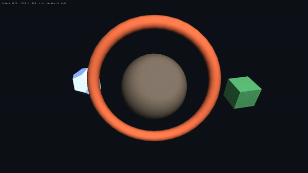

# glut-demo

  

A GLUT program, ported to this console by compiling it.

## About

glut-demo exists to be **evidence**, not a demonstration. oops-sdk grew `<GL/glut.h>` and the rest
of GLU, and the claim that made was that a program written against GLUT builds against this SDK.
The way to know is to write one the way that code is actually written — and build it for the
target.

- **Ordinary GLUT above the last twenty lines** — `main`, `glutInit`, callbacks, `glutMainLoop`,
  the GLU helpers and the solid primitives — with nothing that names the platform. Copy it into a
  desktop GLUT project and it compiles there too.
- **A lit sphere, torus, cube, dodecahedron and teapot**, a frame counter drawn with
  `glutBitmapString`, and pad-to-keyboard mapping so it drives with no keyboard attached.
- **The build is the point**: if this links with every `glut*`/`glu*` symbol resolved, a port of
  the same shape links.

## Screenshot

  

## Docs

- **[Reference](docs/REFERENCE.md)** — what is portable and what isn't, the symbol-table check the build turns on, the teapot, and driving it from the pad.
- [oops-apps catalog & guide](../../../docs/USER_GUIDE.md)
