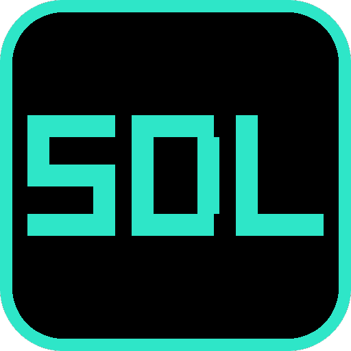

# sdl-probe

  

Upstream SDL2 on the console — the smallest app that proves the dependency integrates.

## About

sdl-probe brings up all four SDL backends at once (video, joystick, game controller, timer),
creates a GL window and context, pumps events, opens the pad and swaps buffers — the whole
minimal SDL2 program, built through [`oops-deps/sdl2`](../../oops-deps/sdl2/).

- **The link is half the job.** Because payload links ignore unresolved symbols, a missing SDL
  function would link silently and fault on hardware; this app is where the undefined-symbol check
  actually runs, and it comes back clean with every SDL backend defined.
- **It ends by itself** after 600 frames or on Options, so it never costs a console run just to
  find out how to stop it.

## Screenshot

  

## Docs

- **[Reference](docs/REFERENCE.md)** — what it exercises, the symbol check, and the per-flip cost.
- [oops-apps catalog & guide](../../../docs/USER_GUIDE.md)
