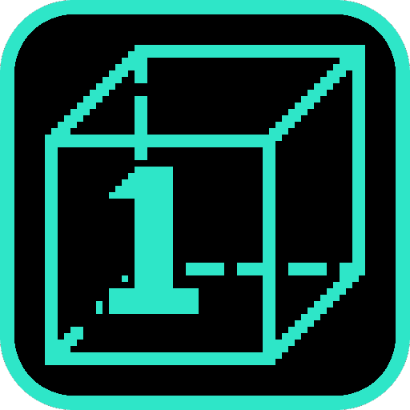
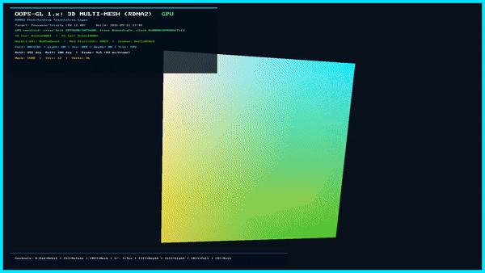

# gl1-cube

  

A rotating cube, torus and sphere drawn through `oops-gl`'s OpenGL 1.x path.

## About

gl1-cube is the collection's **pinned hardware oracle**. The frame it renders was measured on a
retail console and is checked back, register by register, by the oops-sdk test suite — so when the
GL command stream drifts, this is the app that catches it.

- **Ground truth for the whole pipeline.** One known scene, known vertex for vertex, that must
  render the same on hardware and in the [Orbistoun](../../../../orbistoun/) emulator.
- **Live, watchable HUD** — GPU fence state, shader canaries, pipeline toggles and per-frame
  timing, all on screen.
- **Driven over the network** by dropping control files into the title directory: pause, dump the
  oracle record, switch the display tiler, and more.

## Screenshot

  

## Docs

- **[Reference](docs/REFERENCE.md)** — building, control files, reading the HUD, and what a run measures.
- [oops-apps catalog & guide](../../../docs/USER_GUIDE.md)
