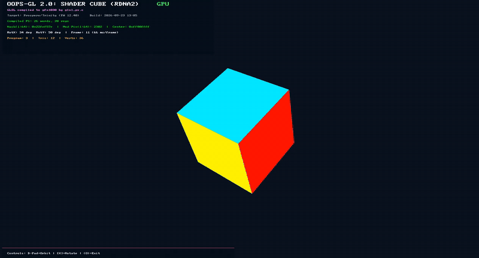

# gl2-cube

  

A cube drawn with a GLSL vertex and fragment shader through oops-gl's OpenGL 2.0 path.

## About

gl2-cube is the smallest end-to-end exercise of the programmable pipeline: compile, link, bind
generic attribute arrays, run the vertex shader per vertex, interpolate the varying, run the
fragment shader per fragment — the whole path, checked against oops-gl's software reference.

- **Measurements chosen to separate the stages** — the front face's colour proves the varying
  arrived, its neighbours catch wrong winding, and a rotation through the `mvp` uniform proves the
  matrix is read and applied.
- **The front end still refuses bad GLSL**, so a compiler that accepted everything can't pass by
  drawing something that happens to look right.
- **It runs on the console**, which it did not when this was written. The bullet here used to say
  "host only, by design — there is no hardware GL 2.0 back end yet"; there is one now, this title
  packages for it (`FORMATS=eboot title`), and the capture below is it running.

## Running on a PS5

  

**The HUD is the evidence, not the cube.** A spinning cube proves very little on its own — the
software rasteriser drew one of those long before any of this reached hardware. What the overlay
says is the part that could not have been faked:

| | |
|---|---|
| `OOPS-GL 2.0: SHADER CUBE (RDNA2)` … `GPU` | the hardware path, not the software reference |
| `GLSL compiled to gfx1030 by glsl_ps.c` | the shader was compiled to real RDNA2 instructions |
| `Compiled PS: 26 words, 20 regs` | and this is how many of them there are |
| `Program: 3 │ Tris: 12 │ Verts: 36` | a linked program object, drawn through generic attributes |

The three faces are the measurement the *About* section describes: each one a different colour
carried by the varying, so a wrong interpolation or a wrong winding changes the picture rather
than dimming it.

**Two things the capture is honest about.** It reads `66 ms/frame`, which is not a number to be
pleased with for twelve triangles — this title hashes its framebuffer every frame for the
self-check, and nothing here has been profiled to say how much of that is the hash and how much
is the pipeline. And its build stamp is `2026-09-23`, so it predates the wave32 fix in oops-sdk
`8f7a40a`; this shader has no branching, so that fault could not have shown in it either way.

## Docs

- [oops-apps catalog & guide](../../../docs/USER_GUIDE.md)
