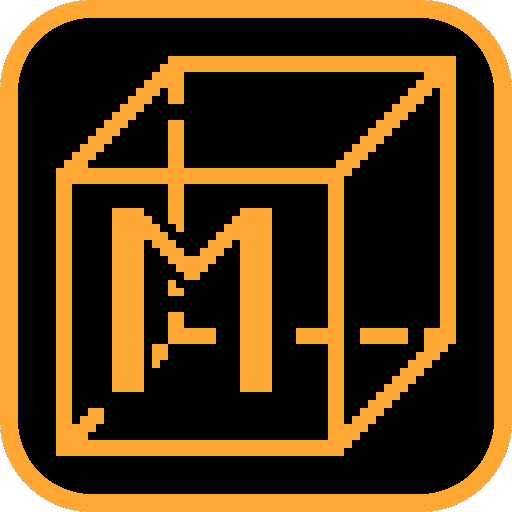
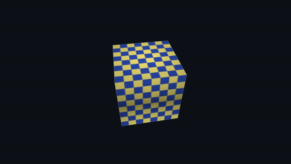

# mesa-cube

  

The example title for oops-mesa: create a GL context, upload geometry and a texture, draw a frame
in a loop, read the pad, and stop cleanly when asked.

## About

The two probes beside this one ask a question and stop. mesa-cube is the file a title author
reads before writing their own, so it is ordinary OpenGL 3.3 practice that reaches for the SDK
the way any oops title would.

- **Three platform-specific lines** - `oops_gl_create` in place of a windowing library,
  `oops_mesa_run_init_array` at the top, and parking instead of returning at the bottom. Each is
  commented where it appears. The pad and the stop file are what the desktop version would do
  with a windowing library and a close event.
- **A broad exercise of the GL stack** - a texture and sampler, a depth buffer with the test on,
  an index buffer, a matrix pipeline (`oops/math.h`), a continuous present loop, and a GPU 2D
  overlay (`oops/hud.h`) composited over the scene. It is an example, not a conformance test.
- **A present-cost profile.** It presents every frame, and `oops_gl_present` reports its cost in
  four parts across the run. The present scans out Mesa's own tiled buffer directly (oops-mesa
  D012).

## Controls

The same set gl1-cube has:

- **Cross** - pause / resume the spin
- **Triangle** - texture on / off
- **Square** - depth test on / off
- **R1** - back-face culling on / off
- **L1** - face shading (lighting) on / off
- **Circle** or **Options** - stop the title
- a `/app0/stop` file (`pros sh touch /app0/stop`) - stop a run with nobody at the pad

The HUD is the shared dashboard from `common/cube_hud.c`, the same one gl1-cube draws.

## Screenshot

  

## Docs

- [oops-mesa bring-up docs](../../../../oops-mesa/docs/)
- [oops-apps catalog and guide](../../../docs/USER_GUIDE.md)
