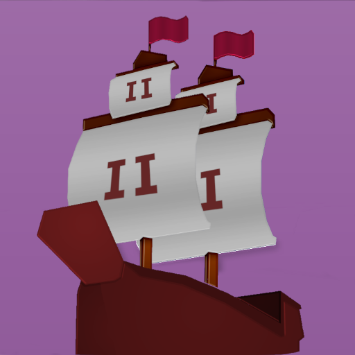

# 2 Ship 2 Harkinian

  

A native port of *The Legend of Zelda: Majora's Mask*, built on the `zeldaret/mm`
decompilation - [upstream](https://github.com/2ship2harkinian/2ship2harkinian), pinned at `5.0.1`.

> **Status: Playable** (with graphical glitches). The game runs at full speed with audio,
> DualSense controller support and on-device ROM extraction, while shader rasterization
> continues to mature.

**It plays from the player's own copy of the game, which they provide on the hardware, at run
time.**

## Controls

The game is controlled with a DualSense pad:

| Pad | Action |
|---|---|
| Left stick | Move Link |
| Right stick | C buttons (items / camera) |
| Cross | Action (A) |
| Square | Sword (B) |
| Circle | C-Right |
| Triangle | C-Up |
| R2 | Shield (R) |
| L2 | Target (Z) |
| L1 | L button |
| Options | Pause (Start) |
| Touchpad click / Create / L3+R3 | Open / close port menu (settings, enhancements) |

Menus can also be navigated with a connected USB keyboard (arrows, Enter, Space, Escape).

`make compile-survey` compiles the tree with the build's own flags. It uses `-fsyntax-only` and
does not link, and a payload link does not report an unresolved symbol, so a clean survey is not
a working port.

## The GL surface

`gfx_opengl.cpp` compiles differently per platform, so the surface is counted for the
configuration this port builds, against the definitions in `oops-sdk/src/gl/*.c`:

| symbol | where | compiled here? |
|---|---|---|
| `glGenVertexArrays`, `glBindVertexArray` | inside `#if defined(__APPLE__) \|\| defined(USE_OPENGLES)` | not from here - but see below |
| `glBlitFramebuffer` | unguarded | yes |
| `glRenderbufferStorageMultisample` | unguarded | yes - but behind a runtime `msaa_level` |

ImGui's GL3 backend, which libultraship links, uses vertex array objects unconditionally on
desktop GL. `imgui_impl_opengl3.cpp` needs `glGenVertexArrays`, `glBindVertexArray`,
`glDeleteVertexArrays`, `glGetStringi`, and the enums `GL_MAJOR_VERSION`, `GL_MINOR_VERSION`,
`GL_NUM_EXTENSIONS`, `GL_VERTEX_ARRAY_BINDING`, `GL_PIXEL_UNPACK_BUFFER` and
`GL_PIXEL_UNPACK_BUFFER_BINDING`.

## The shader dialect

`gfx_opengl.cpp` selects its shader dialect at compile time: `#version 410 core` on Apple,
`#version 300 es` under `USE_OPENGLES`, and otherwise `#version 130` with `varying`, `texture2D`
and `gl_FragColor` - the GL 2.1-era idioms.

`gl2-probe`'s `libultraship-dialect` arm checks every construct the renderer emits: `attribute`,
`varying`, `texture2D`, `gl_FragColor`, two samplers and an interpolated colour input. oops-gl
refuses `#version 130` - so `patches/0001-ask-for-the-glsl-this-target-implements.patch` turns it
into `#version 120` in `libultraship/src/fast/backends/gfx_opengl.cpp`.

## Run time, not build time

This builds with no ROM. The player puts their own copy on the hardware (in `/data/homebrew/TSHP00001/`),
the game notices it on first run, converts it into an `mm.o2r` archive and starts.

`ZAPDLib` and `OTRExporter` are linked into the payload binary, so the conversion runs on the
device rather than on a PC beforehand.

## Dependencies

The game (`mm/2s2h`), the runtime (`libultraship/src`), and the linked-in asset conversion
(`ZAPDTR`, `OTRExporter`) are C++20 with some C.

| library | vendored at | built |
|---|---|---|
| spdlog | [`oops-deps/spdlog`](../../oops-deps/spdlog) | header-only |
| nlohmann/json | [`oops-deps/nlohmann-json`](../../oops-deps/nlohmann-json) | header-only |
| tinyxml2 | [`oops-deps/tinyxml2`](../../oops-deps/tinyxml2) | `libtinyxml2.a` |
| prism-processor | [`oops-deps/prism-processor`](../../oops-deps/prism-processor) | `libprism.a` |
| libgfxd | [`oops-deps/libgfxd`](../../oops-deps/libgfxd) | `libgfxd.a` |
| stb | [`oops-deps/stb`](../../oops-deps/stb) | `libstb.a` |
| thread-pool | [`oops-deps/thread-pool`](../../oops-deps/thread-pool) | header-only |
| StormLib | [`oops-deps/stormlib`](../../oops-deps/stormlib) | `libstorm.a` |
| libzip | [`oops-deps/libzip`](../../oops-deps/libzip) | `libzip.a` |
| zlib | [`oops-deps/zlib`](../../oops-deps/zlib) | `libz.a` |
| SDL | [`oops-deps/sdl2`](../../oops-deps/sdl2) | see its README |
| ImGui | [`oops-deps/imgui`](../../oops-deps/imgui) | see above |

## Submodules

`libultraship`, `ZAPDTR` and `OTRExporter` are submodules of the pinned commit. With
`UPSTREAM_SUBMODULES=1`, `common/upstream-fetch.sh` checks them out after the revision is verified
and before patches apply.
