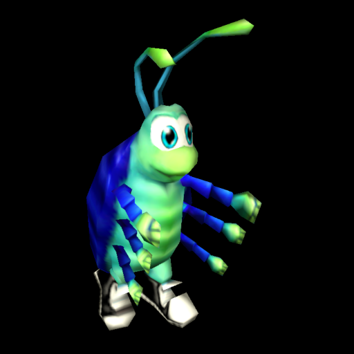

# Bugdom

<p align="center">
  
</p>

Pangea's garden adventure, ported through oops-sdk.

## About

Bugdom is a 1999 Macintosh game, released as freeware and ported to modern systems by jorio: 78 C
sources and one C++, drawing through immediate-mode OpenGL 1.x, on SDL2 and on jorio's Pomme. It is
tracked against a pinned commit.

- **Pinned by commit hash** — `18b413f8`, the `1.3.4` release, newest of five. A **lightweight** tag.
- **Fetched, not vendored** — `make` pulls upstream on demand.
- **Brings its own game data** — 66 MB under `Data/`, 207 files. Nothing is required from the player.
- **Submodule** — `extern/Pomme` is one, so the fetch needs `UPSTREAM_SUBMODULES=1`. Ship of
  Harkinian's lock is the precedent.

## Building

```
make            # the payload
make package    # the title package with the game data, which is what runs
make census     # compile every source for the target and report, without linking
```

## What is measured

**It links and it packages.** `build/bugdom.elf` is 4,981,312 bytes with `common/app.mk`'s
undefined-symbol guard clean, and `make package` produces 216 files — eboot, `sce_sys/`,
`sce_module/libc.prx` and the whole of `Data/`.

**`oops-gl` covers Bugdom's GL surface completely** — all 51 entry points it names, and it calls them
**by symbol**: no `SDL_GL_GetProcAddress`, no glad, no GLEW, so a missing one is an ordinary link
error rather than a NULL at run time. The renderer is `glBegin`/`glVertex3f` immediate mode, the same
shape as Neverball and Extreme Tux Racer, so `OOPS_RENDERER = gl1` is the target and there is no
shader question.

**SDL2, not SDL3.** The candidate survey read `find_package(SDL3 ...)` out of a clone of *master*;
the pinned 1.3.4 asks for SDL2, and so does Bugdom 2's pinned v4.0.0.
[`docs/PORTING.md`](docs/PORTING.md) has the detail, and the lesson: read the revision the lock names.

**Pomme took libc++'s real `<filesystem>`.** It bundles `ghc::filesystem` as a stand-in and would have
needed a full POSIX filesystem underneath it — file identity, hard links, `utimensat`, `std::wstring`.
Building libc++'s own implementation instead cost eleven declarations in the port layer, each with an
honest answer, and one patch to lift two arms of an `#if` that exclude this build — one of which
excludes *every* clang, everywhere, and not on purpose.

**Nothing has run.** No frame, no sound, no input. `docs/PORTING.md` lists what that leaves open.
