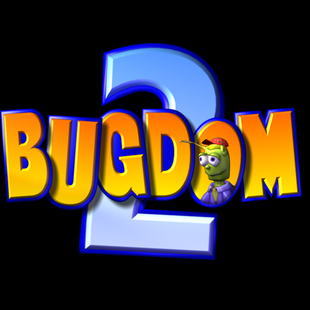

# Bugdom 2

<p align="center">
  
</p>

Pangea's sequel, ported through oops-sdk.

## About

Bugdom 2 is a 2002 Macintosh game, released as freeware and ported to modern systems by jorio: 97 C
sources and one C++ (`Boot.cpp`), drawing through immediate-mode OpenGL 1.x, on SDL2 and on jorio's
Pomme. It is tracked against a pinned commit.

- **Pinned by commit hash** — `4050d6f9`, the `v4.0.0` release, and upstream's only tag. A
  **lightweight** tag, so the ref and the commit are the same object.
- **Fetched, not vendored** — `make` pulls upstream on demand.
- **Brings its own game data** — `Data/`, 404 files. Nothing is required from the player.
- **Submodule** — `extern/Pomme` is one, so the fetch needs `UPSTREAM_SUBMODULES=1`.

## Building

```
make            # the payload
make package    # the title package with the game data, which is what runs
make census     # compile every source for the target and report, without linking
make glsurface  # whether oops-gl answers the entry points this game loads by name
```

## Most of this port is Bugdom's

Same author, same engine lineage, the same Pomme, the same SDL2, the same freeware data in the
repository. The expensive questions — whether libc++'s `<filesystem>` could replace Pomme's bundled
`ghc::filesystem`, what the POSIX layer was missing, why `main` comes out mangled — were answered next
door, and [`../bugdom/docs/PORTING.md`](../bugdom/docs/PORTING.md) is where the reasoning lives. This
title carries the same one-line patch to `CompilerSupport/filesystem.h` and nothing else.

## Where it differs

**`POMME_NO_QD3D`.** Bugdom draws through Pomme's QuickDraw 3D reimplementation; Bugdom 2 brought its
own `Source/3D` and switches Pomme's off. So three more Pomme sources are out of the build, the
`-I.../QD3D` include Bugdom needs is absent here, and the model format is `.bg3d` rather than `.3dmf`.

**A different Pomme revision** — `c6a38eab` where Bugdom 1.3.4 records `ef94150e`. That is upstream's
choice, not an oversight, and one pinned hash still pins everything because the submodule revision
lives in the pinned commit's own tree.

**It uses a GL loader, and Bugdom does not.** `Source/3D/OGL_Support.c:132,135` binds
`glActiveTexture` and `glClientActiveTexture` through `SDL_GL_GetProcAddress`, so the by-name trap
applies: a lookup that answers NULL is a null call at run time, not a link error. Both are in
oops-gl's table; `make glsurface` is the standing check, and it reads the names out of the source
rather than from a list here, so a name added upstream is checked too.

**`gluLookAt` and `gluPerspective`**, which is why `OOPS_FEATURES` names `glu` where Bugdom's does not.

## What is measured

**71 GL entry points, all defined by oops-gl.** Three names a grep finds are not calls:
`glLockArraysEXT` and `glUnlockArraysEXT` are commented out at `Source/3D/MetaObjects.c:756,759`, and
`glTextureName` is a local variable in `OGL_Support.c:848`. Checked, because two of the three would
otherwise have read as a missing compiled-vertex-array extension.

**SDL2, read at the pinned revision** — `find_package(SDL2 REQUIRED COMPONENTS main)` at
`CMakeLists.txt:68`. `oops-deps/sdl3` exists and is complete; neither Bugdom pin needs it.

[`docs/PORTING.md`](docs/PORTING.md) carries the standing numbers and what has not been measured.
