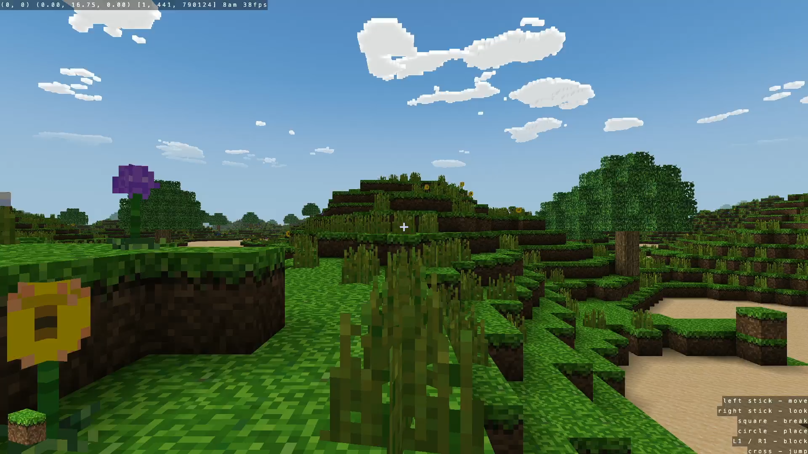

# Craft

  

A voxel world to dig, build and fly through, ported to the hardware.

## About

Craft is a small Minecraft-like game in C: an infinite procedural world, a handful of block
types, and a renderer that draws all of it through four shader pairs. It is one of the
collection's ported upstream titles, tracked against a pinned commit.

- **Pinned by commit hash** to upstream's master. `upstream.lock` says why master rather than the
  `v1.0` tag.
- **Fetched, not vendored** - the upstream sources are pulled on demand; only the port's own
  `shim/` and `patches/` live here. Two patches, each making something overridable rather than
  changing it, so the tree stays close to upstream: one lets the build say where the assets and
  the database are, the other draws the pad's controls on screen.
- **Drawn by Mesa** - `OOPS_RENDERER = mesa` puts the title on upstream Mesa with the radeonsi
  driver, which runs the vertex stage on the GPU. Craft submits a world's worth of geometry and
  oops-gl's GL 2.0 path transforms every vertex on the CPU, which is the difference between 0.05
  and 38 frames a second on the same scene.

## Building

`make census` compiles each source under the real target flags and reports what it stops on;
`upstream/src/auth.c` is expected to fail it, being excluded from the build for wanting libcurl.
`make check` runs the census. `make title` packages the payload and `make stage-data` copies the
textures and shaders in beside it. The payload's source list is in the Makefile.
[docs/PORTING.md](docs/PORTING.md) covers what the shim replaces and how each platform
dependency is answered.

Mesa is a hosted build: it brings oops-mesa's sysroot and a real C library, so this title links
neither `common/posix.mk` nor upstream's vendored `tinycthread.c`, and `make imports` writes the
manifest naming which system library answers each libc symbol.

## Controls

The shim reads a USB keyboard and mouse when one is attached and the pad always, every frame,
and whichever moved wins - there is no mode to pick.

| Pad | Does |
|---|---|
| Left stick | Walk |
| Right stick | Look |
| Cross | Jump |
| Square / Circle | Break / place |
| L1 / R1 | Cycle the held block |

The list is on screen in the bottom right, and it is every control a pad has. Chat, commands and
signs need a keyboard: they open a typing line that upstream leaves only on Enter or Escape,
neither of which a pad can produce, so Options is deliberately unmapped rather than a way to
strand yourself. There is no pause menu because Craft has none.

## Docs

- [Porting notes](docs/PORTING.md) - what the shim replaces and how each dependency is answered
- [oops-titles overview](../README.md)
- [oops-apps catalog and guide](../../../docs/USER_GUIDE.md)

## Upstream

[fogleman/Craft](https://github.com/fogleman/Craft), MIT licensed.
