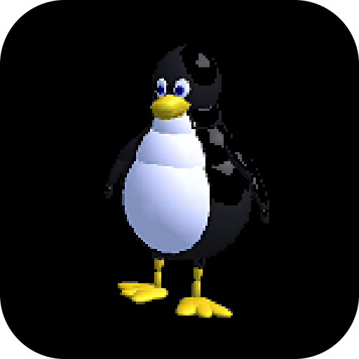
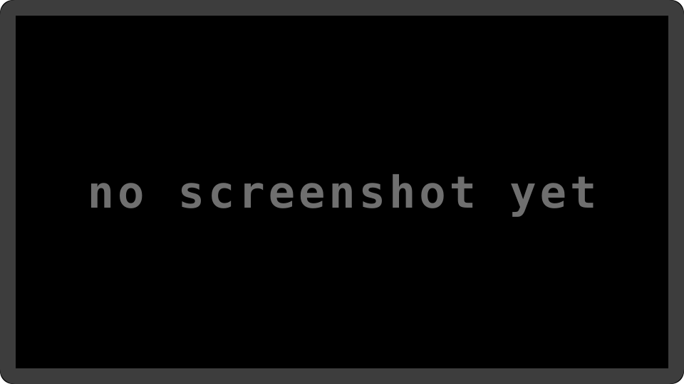

# Extreme Tux Racer

  

An open-source downhill racer, played to the finish on Prospero — the collection's first ported
title in C++, and the one that paid for the C++ runtime the rest inherit.

## About

Extreme Tux Racer is the title that pays the C++ runtime cost for the ones that follow: C++ used
as a better C, with **0 `throw` and 0 `dynamic_cast`** — measured, not assumed — so
`-fno-exceptions -fno-rtti` genuinely applies.

- **A clean port, no patches.** ETR's own `#if defined(OS_LINUX)` include chain is satisfied
  entirely from a shim, so `patches/` stays empty and the title survives an upstream bump.
- **Every gap measured, not estimated** — the shared C++ runtime (12 symbols), a nine-function
  POSIX shim, the SDL2 include prefix, and a three-line entry point are all done.
- **The whole stack is in place**: `src/oops-deps/libcxx` answers the `std::string` and iostream
  uses that were this title's last gap, and SDL2, SDL2_image, SDL2_mixer, freetype, libpng and zlib
  are pinned beside it. `make package` builds the runnable title — the payload plus ETR's 55 MB of
  content, which goes *inside* the package because upstream reads it from `argv[0]`'s directory.

GPL v2; 55 MB of upstream data, none of it committed here (fetched via `upstream.lock`).

## Screenshot

  

## Docs

- **[Porting notes](docs/PORTING.md)** — the mirror choice, what is done, and the one dependency left.
- [oops-titles overview](../README.md)
- [oops-apps catalog & guide](../../../docs/USER_GUIDE.md)

---

Logo: Tux, from the upstream project's own character art, keyed onto black. Extreme Tux Racer is GPL v2.
