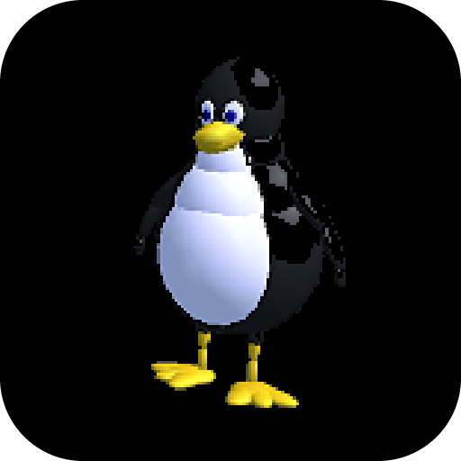
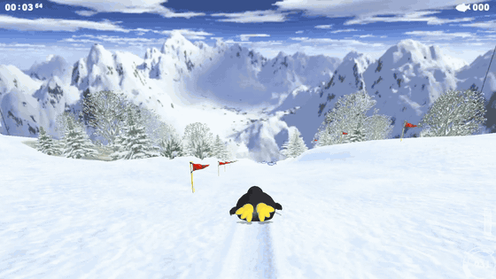
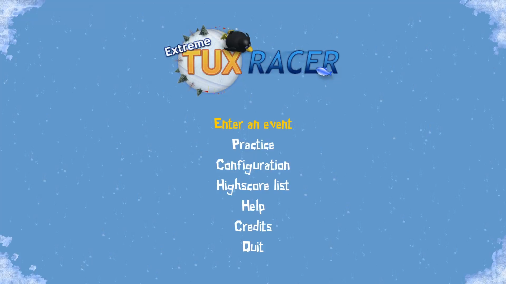

# Extreme Tux Racer

  

An open-source downhill racer, ported to Prospero-generation hardware - a C++ title on the
collection's shared C++ runtime.

## About

Extreme Tux Racer uses C++ as a better C, with no `throw` and no `dynamic_cast`, so
`-fno-exceptions -fno-rtti` applies.

- **No patch for the platform layer.** ETR's own `#if defined(OS_LINUX)` include chain is satisfied
  entirely from a shim.
- **The platform layer** - the shared C++ runtime, a POSIX shim, the SDL2 include prefix, and a
  three-line entry point.
- **The dependencies** - `src/oops-deps/libcxx` answers the `std::string` and iostream uses, and
  SDL2, SDL2_image, SDL2_mixer, freetype, libpng and zlib are pinned beside it. `make package`
  builds the runnable title: the payload plus ETR's content, which goes inside the package
  because upstream reads it from `argv[0]`'s directory.
- **First boot** - on initial launch, the title unpacks assets and exits; subsequent launches load directly and run normally.

GPL v2; the upstream data is not committed here (fetched via `upstream.lock`).

## Screenshots

  

  

[The clip as a video](assets/demo.webm). Everything here is captured from the hardware.

## Hardware additions

Five things this port adds that upstream has no reason to. Each is a patch only where it has to
be, because a patch is rebased onto every upstream revision.

- **The pad drives everything** - `0002` and `0006`. Every menu registers a keyboard handler and
  NULL for the joystick, so one translation in `winsys.cpp` covers every screen: a pad press
  arrives at the handler the same key would. The race is the exception, because it registers a
  joystick handler of its own and the translation steps aside for it, so `racing.cpp` maps the
  buttons itself: Cross and R1 charge and jump, L1 holds a trick, Options pauses and Circle
  quits.
- **A controls reference card** - `0005`, on the `HELP` screen upstream has. The wireframe is the
  shared one from [`common/assets/controls/`](../../../common/assets/controls/), loaded straight
  to a GL id rather than added to upstream's texture list, and it ships in the packaged data.
- **A loading screen** - `0001`. Upstream builds a course with no feedback, which on this
  hardware is long enough to read as a hang.
- **The font atlas is rebuilt** - `0003`, because the glyph texture comes out wrong here.
- **NaN-safe course indices** - `0004`. A NaN reaching an array index is a fault on this target
  rather than a wrong pixel.

Rumble and motion control exist as shared pieces ([`common/haptics.h`](../../../common/haptics.h))
and are not wired to this game's physics.

## Docs

- [Porting notes](docs/PORTING.md) - the mirror choice, the platform layer, and the data layout.
- [oops-titles overview](../README.md)
- [oops-apps catalog and guide](../../../docs/USER_GUIDE.md)
