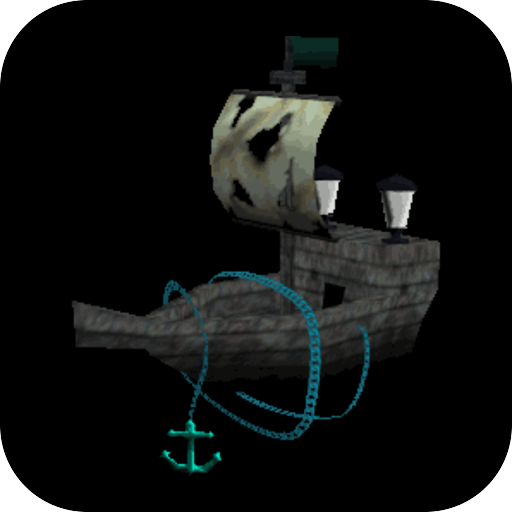

# Ghostship

<p align="center">
  
</p>

Super Mario 64 as a native port, playing from your own copy of the game.

## About

Ghostship is Harbour Masters' port of Super Mario 64, built from the decompilation onto
`libultraship` - the runtime [Ship of Harkinian](../ship-of-harkinian/) and
[Spaghetti Kart](../spaghetti-kart/) run on. It supersedes [`sm64`](../sm64/), whose upstream
compiles the ROM's assets into the program and so can never be published.

- **Pinned to a finished release** - `3.0.0`, by commit hash, with `libultraship` and Torch at
  the revisions that commit records.
- **Fetched, not vendored** - the upstream sources are pulled on demand via `upstream.lock`;
  only the port's own `shim/` and `patches/` live here.

## Your ROM

The build carries no game assets. Copy a Super Mario 64 ROM (US or JP, `.z64`) beside
`eboot.bin`:

```
/data/homebrew/GHST00001/sm64.z64
```

The first start converts it to `sm64.o2r` on the console, with Torch - the converter upstream
links for its own first-run extraction. Without the ROM the title says exactly this on screen
and stops.

## Building

`make` prints the survey: the pin, the dependencies still to vendor, and what the player
supplies. `make GHST_ARMED=1 title` builds the payload.

## Docs

- [oops-titles overview](../README.md)
- [oops-apps catalog and guide](../../../docs/USER_GUIDE.md)
