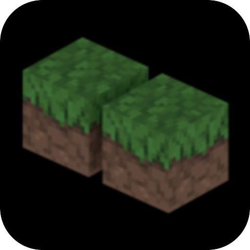

# Mineclonia

  

A survival voxel game - gather, build, explore - on the Luanti engine, ported to the hardware.

## About

Luanti (formerly Minetest) is a voxel engine in C++ scripted in Lua; Mineclonia is a game
written for it. Both are free, so the package is complete and the player supplies nothing. A
separate title from [Craft](../craft/), which is its own small engine.

- **Two origins** - the engine in `upstream.lock` (`5.17.0`) and the game in
  `upstream-game.lock` (`0.123.1`), each a release pinned by commit hash.
- **Fetched, not vendored** - only the port's own `shim/` and `patches/` live here.
- **Lua 5.1, bundled** - the engine carries its own Lua and `bitop`, so there is no LuaJIT and
  nothing needs executable memory.

## Building

`make title` builds the payload. `make package` adds the engine's Lua, shaders, fonts and
textures and the game as one tar beside `eboot.bin`, which the title unpacks the first time it
starts: some 10,000 files, which would otherwise be copied onto the console one at a time.
`make survey` prints the pins and the dependencies; `make census` compiles every source and
names any that fail.

## Docs

- [oops-titles overview](../README.md)
- [oops-apps catalog and guide](../../../docs/USER_GUIDE.md)
