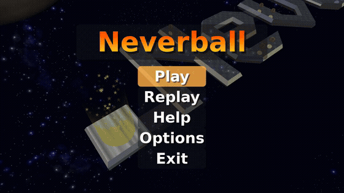

# Neverball

  

Tilt the floor, not the ball - an open-source arcade balance game, ported to the hardware.

## About

Neverball rolls a ball through an obstacle course by tilting the floor, racing the clock and
collecting coins. It is one of the collection's ported upstream titles, tracked against a pinned
release.

- **Pinned to a finished release** - `neverball-1.6.0`, by commit hash rather than tag, so the
  tree a build starts from cannot move underneath it.
- **Fetched, not vendored** - the upstream sources are pulled on demand via `upstream.lock`; only
  the port's own `shim/` and `patches/` live here.

## Screenshot

  

## Hardware additions

Things this port adds that upstream has no reason to. Each lives outside a patch wherever
possible, because a patch is rebased onto every upstream revision.

- **Motion tilt** - tilt the pad to tilt the floor. Off by default and switched on in Options;
  the `Controls` page says so. Neverball has a tilt-sensor interface with a backend chosen by
  upstream's Makefile, and this port adds one in
  [`shim/nb_tilt_dualsense.c`](shim/nb_tilt_dualsense.c). Axis order, inversion, sensitivity and
  deadzone are knobs in `/app0/oops-input`, so changing one costs a file copy rather than a
  rebuild.
- **Rumble** on a bounce, at the strength the bounce sound is mixed at. The decay is shared, in
  [`common/haptics.c`](../../../common/haptics.c); this title contributes one call.
- **A controls reference card**, on the `Controls` page of the help screen, reachable from the
  title screen. The wireframe is the shared one from
  [`common/assets/controls/`](../../../common/assets/controls/), and the bindings are read from
  the same configuration the play state tests, so the card cannot disagree with the game.
- **Settings persist.** Upstream saves once, after the main loop returns; a title here is closed
  from the system menu and never gets there, so options save when the screen is left. Motion
  tilt's own on/off is stored separately, in `/app0/oops-tilt`.
- **The pad's button indices** - `patches/0009`. Upstream's defaults describe an older
  controller's layout, and this platform's SDL backend reports `SDL_GameControllerButton` order,
  where Options is `start` and L1/R1 rotate the view.
- **A bounds check on the ball model** - `patches/0010`. `set_curr_ball` indexes the scanned list,
  and on this platform an assert is `abort`.

The knobs in `/app0/oops-input` take effect without a rebuild: `tilt-swap`, `tilt-invert-x`,
`tilt-invert-z`, `tilt-gain`, `tilt-deadzone`, and `rumble=on|off`.

## Docs

- [oops-titles overview](../README.md)
- [oops-apps catalog and guide](../../../docs/USER_GUIDE.md)

---

Logo: the Neverball ball, from the upstream project's own icon, recomposited on black. Neverball is GPL v2.
