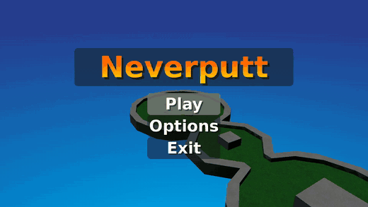

# Neverputt

<p align="center">
  
</p>

Miniature golf on the Neverball engine - [upstream](https://github.com/Neverball/neverball),
pinned at `neverball-1.6.0`.

## Screenshot

<p align="center">
  
</p>

## The second binary of the Neverball tree

Neverputt is not a separate project. Upstream's Makefile builds two programs from one checkout,
`BALL_OBJS` and `PUTT_OBJS`, and Neverputt is the second: the sources under `putt/` plus a subset
of the `share/` files Neverball compiles, with its own `main` at `putt/main.c:279`. It uses the
same pinned dependencies, POSIX shim, `mapc` host tool and fixed-function GL layer as Neverball.

**`NP_SHARE` in the Makefile is upstream's own `PUTT_OBJS`, not Neverball's list with things
removed.** The differences:

| | why |
|---|---|
| no `tilt_null` | upstream adds a tilt backend to `BALL_OBJS` only (Makefile:349-357); Neverputt has no tilt sensing |
| no `queue`, no `cmd` | those carry the client/server command stream Neverball's replay and simulation split needs; Neverputt simulates in one place |
| `hmd_null` without `hmd_common` | the common half belongs to the openhmd and libovr arms (Makefile:361-370) |

## Building

```
make          # fetch upstream, build the payload
make data     # compile the .map sources into .sol - minutes, needed once
make package  # the title directory, with the data in it
```

`make data` needs `git` for the fetch, which the `silkeh/clang:21` container does not carry - run
the fetch on the host and the rest in the container.

`make package`, not `make title`: `common/app.mk` builds a title directory out of the payload and
`sce_sys/`, and a port also ships the program's own content, which this game does not start
without.

## Its own upstream checkout

`upstream.lock` names the same repository and commit as `../neverball/upstream.lock`, and fetches
its own copy. A title that read a sibling title's working tree would depend on whether somebody
had run `make upstream-clean` next door and on which revision that lock names. The fetch script
verifies the hash after checkout and after patches. The two locks move together by convention,
not by requirement.

## Patches

Neverball's patches in `ball/` do not apply, and its `share/` diagnostics are added here only
when something is opaque. Neverputt's input is SDL joystick (`putt/main.c:299`), an aim-and-power
interaction.

- **`0001` - settings persist.** Upstream calls `config_save` once, at `putt/main.c:386`, after
  the main loop returns, and a title here is closed from the system menu rather than quitted.
  Saving when the options screen is left catches every setting at once and does not depend on the
  kill timer.
- **`0002` - rumble on a bounce.** The bounce strength the sound is mixed at goes to the pad as
  well, so the speaker and the motors agree by construction. The decay lives in
  `common/haptics.c`, shared with every port; the shim starts and stops it around `main`.
- **`0003` - the pad's button indices.** `share/config.c` is shared with Neverball, and
  `putt/main.c:157` pauses on `CONFIG_JOYSTICK_BUTTON_START`. This platform reports
  `SDL_GameControllerButton` order, where Options is 6.

Neverputt has no help screen (`putt/st_all.c` has no `st_help`), so it has no controls reference
card, and upstream's tilt interface is Neverball's alone (`ball/main.c:270`).

## The icon

`assets/icon0.png` is upstream's own `data/icon/neverputt.png` composited on black at 512×512.
