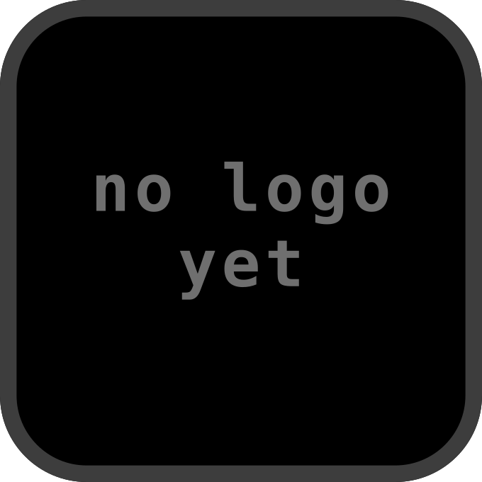

# Q3Rally

  

Arcade rally combat on ioquake3 — queued for the console.

## About

Q3Rally is a standalone racing game built on the ioquake3 engine: 788 C sources, no C++, drawing
through ioquake3's `renderergl1` fixed-function renderer. It is tracked against a pinned commit.

- **Pinned by commit hash** — `26828942`, the `v0.7d` release. A **lightweight** tag, so the ref and
  the commit are the same object; `upstream.lock` records that, because the annotated case is the
  one that bites.
- **Fetched, not vendored** — `make` pulls upstream on demand; only the port's own `shim/`,
  `patches/` and notes live here.
- **Brings its own game data** — 629 MB under `baseq3r/`. Nothing has to be supplied by the player
  and no Quake 3 purchase is involved.

## Why this one is first among its cohort

It was surveyed alongside Bugdom, Bugdom 2, `isle-portable`, OpenPhantom and two Godot projects, and
it is the only one that needs no new foundation:

| | Q3Rally | Bugdom / Bugdom 2 | isle-portable |
|---|---|---|---|
| SDL | **SDL2, already vendored** | SDL3 — a second SDL backend | SDL3 |
| language | **C only** | C + C++ (Pomme) | 292 C++ |
| GL vs `oops-gl` | 67 of 72, 1 real gap | 51/51 and 74/74 | 44/44 on its GL1 backend |
| player must supply | **nothing** | nothing | LEGO Island 1.1 |

Bugdom's GL story is actually cleaner — complete coverage rather than one gap — but it is behind
porting SDL3, which is a new backend rather than a version bump. Being pure C also keeps this clear
of the libc++ questions the C++ titles carry.

[`docs/PORTING.md`](docs/PORTING.md) has the census, the one gap, and the parts that have not been
measured — the bytecode VM and the nine libraries upstream bundles that this collection also vendors.
