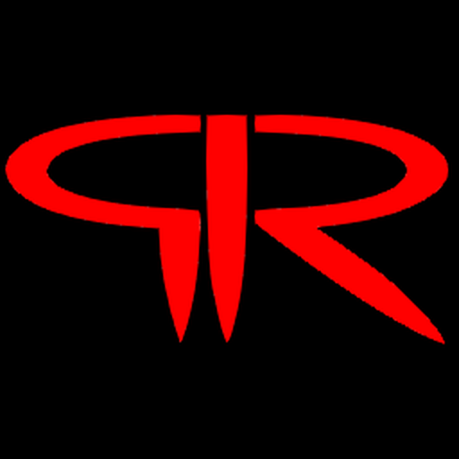

# Q3Rally

<p align="center">
  
</p>

Arcade rally combat on ioquake3.

## About

Q3Rally is a standalone racing game built on the ioquake3 engine: C sources, no C++, drawing
through ioquake3's `renderergl1` fixed-function renderer, on the SDL2 already vendored in
`src/oops-deps/sdl2`. It is tracked against a pinned commit.

- **Pinned by commit hash** to the `v0.7d` release. It is a lightweight tag, so the ref and the
  commit are the same object; `upstream.lock` records that.
- **Fetched, not vendored** - `make` pulls upstream on demand; only the port's own `shim/`,
  `patches/` and notes live here.
- **Brings its own game data** under `baseq3r/`. Nothing has to be supplied by the player.

## Building

```
make            # the payload
make qvm        # the three bytecode VMs the engine loads at run time
make pak        # baseq3r/pak0.pk3, the game data, from upstream's tree
make title      # the title package: the payload and its sce_sys, without the game data
make package    # the same with baseq3r/pak0.pk3 staged into it, which is what runs
make census     # compile every source for the target and report, without linking
make glsurface  # whether oops-gl answers the GL entry points this engine loads by name
```

`make census` compiles with `-fsyntax-only` and does not link, so a clean census is not a
working payload. `make glsurface` exists because this engine resolves GL by name rather than
by symbol: a missing entry point is a NULL at run time, not a link error, which is the one
failure a clean build cannot show. `make census-one F=<path>` reports a single file.

## Notes

`OOPS_RENDERER` is `gl1`. The engine loads three QVM modules at run time, built by upstream's
own bytecode compiler, so `make qvm` runs before `make pak` and is a prerequisite of it. That
target counts the modules and reads each one's `vmMagic`, because a wrong magic is a
`Com_Error` on the console rather than anything a build would have shown.

[`docs/PORTING.md`](docs/PORTING.md) covers the source list, the POSIX surface, the by-name GL
surface, the bytecode VM and the data package.
