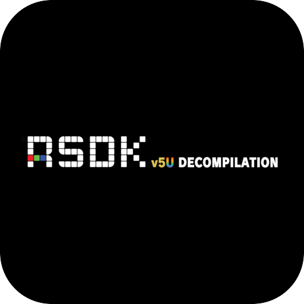

# Sonic Mania

<p align="center">
  
</p>

Sonic Mania on the RSDKv5 decompilation, playing the data from your own copy of the game.

## About

The decompiled game logic, linked into the decompiled RSDKv5 engine it runs on (upstream's
`GAME_STATIC`). The engine draws in software and presents through SDL.

- **Pinned to a finished release** - `v1.1.1`, by commit hash, with RSDKv5 at the revision that
  commit records.
- **Fetched, not vendored** - the upstream sources are pulled on demand via `upstream.lock`;
  only the port's own `shim/` and `patches/` live here.

## Your game data

The build carries no game data. Copy `Data.rsdk` from your Sonic Mania install beside
`eboot.bin`:

```
/data/homebrew/SMNA00001/Data.rsdk
```

Without it the title says exactly this on screen and stops.

## Building

`make` prints the survey: the pin, the dependencies still to vendor, and what the player
supplies. `make SMNA_ARMED=1 title` builds the payload.

## Docs

- [oops-titles overview](../README.md)
- [oops-apps catalog and guide](../../../docs/USER_GUIDE.md)
