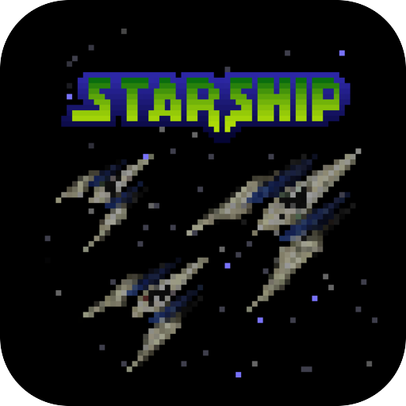

# Starship

<p align="center">
  
</p>

Star Fox 64 as a native port, playing from your own copy of the game.

## About

Starship is Harbour Masters' port of Star Fox 64, built from the decompilation onto
`libultraship` - the runtime [Spaghetti Kart](../spaghetti-kart/) runs on, with the same ROM
converter, Torch.

- **Pinned to a finished release** - `v2.0.0`, by commit hash, with `libultraship` and Torch at
  the revisions that commit records.
- **Fetched, not vendored** - the upstream sources are pulled on demand via `upstream.lock`;
  only the port's own `shim/` and `patches/` live here.

## Your ROM

The build carries no game assets. Copy a Star Fox 64 ROM (big-endian `.z64`, any version
upstream's `config.yml` lists) beside `eboot.bin`, under the name upstream's non-desktop path
reads:

```
/data/homebrew/STRF00001/baserom.us.rev1.z64
```

The first start converts it to `sf64.o2r` on the console, with Torch. Without the ROM or a
converted archive the title says exactly this on screen and stops.

## Building

`make title` builds the payload. `make package` adds the port's own `starship.o2r` and what Torch
reads to convert the ROM, `config.yml` and `assets/`. `make survey` prints the pins and what the
player supplies; `make census` compiles every source and names any that fail.

## Docs

- [oops-titles overview](../README.md)
- [oops-apps catalog and guide](../../../docs/USER_GUIDE.md)
