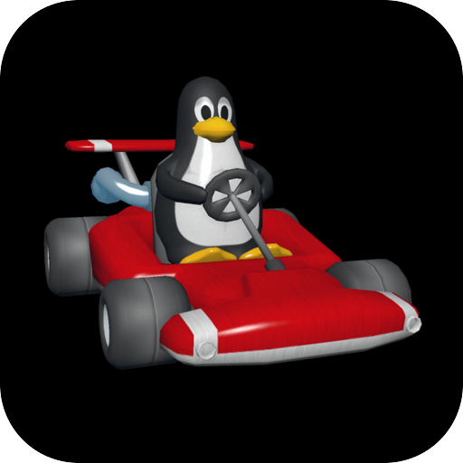

# SuperTuxKart

  

3D kart racing with Tux and friends, ported to the hardware.

## About

SuperTuxKart is an open-source kart racer in C++ on its own Irrlicht fork. The game and its
data are free, so the package is complete and the player supplies nothing. It sits beside
[Extreme Tux Racer](../extreme-tux-racer/) rather than replacing it.

- **Two origins** - the code in `upstream.lock` (`1.5`, by commit hash) and the data in
  `upstream-assets.lock`, the project's `stk-assets.zip` for the same release, pinned by its
  SHA-256 digest.
- **Fetched, not vendored** - only the port's own `shim/` and `patches/` live here.
- **OpenGL 3.3** - SuperTuxKart 1.x has no GL 2 renderer, so this title draws through
  [oops-mesa](../../oops-mesa/).
- **One archive for the data** - 4,279 files ship as a single archive and unpack at first run.

## Building

`make` prints the survey: the pins and the dependencies still to vendor.
`make STKT_ARMED=1 title` builds the payload.

## Docs

- [oops-titles overview](../README.md)
- [oops-apps catalog and guide](../../../docs/USER_GUIDE.md)
