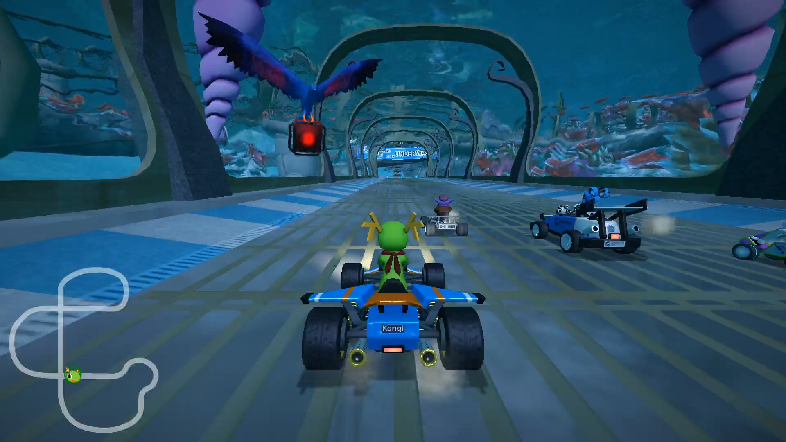
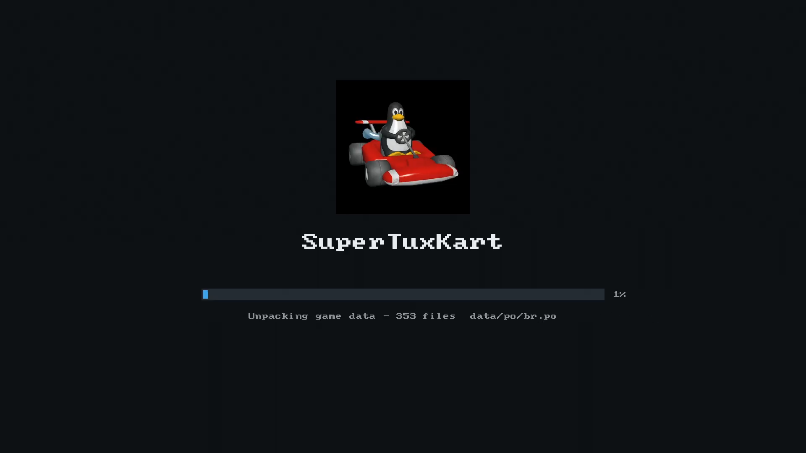
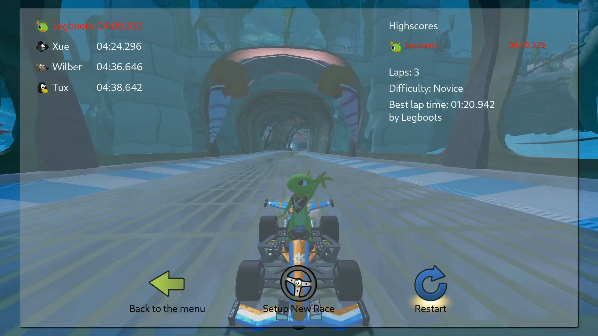
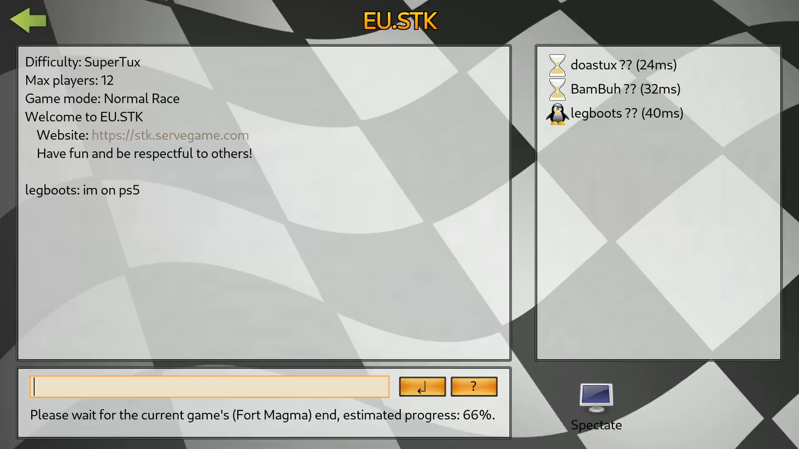

# SuperTuxKart

  

3D kart racing with Tux and friends, ported to the hardware.

## About

SuperTuxKart is an open-source kart racer in C++ on its own Irrlicht fork. The game and its
data are free, so the package is complete and the player supplies nothing. It sits beside
[Extreme Tux Racer](../extreme-tux-racer/) rather than replacing it.

- **Two origins** - the code in `upstream.lock` (`1.5`, by commit hash) and the data in
  `upstream-assets.lock`, the project's `stk-assets.zip` for the same release, pinned by its
  SHA-256 digest.
- **Fetched, not vendored** - only the port's own `shim/` and `patches/` live here.
- **OpenGL 3.3** - SuperTuxKart 1.x has no GL 2 renderer, so this title draws through
  [oops-mesa](../../oops-mesa/).
- **One archive for the data** - 4,279 files ship as a single archive and unpack at first run,
  behind a loading screen.

## Screenshots

  

  

  

  

[A clip of a race](assets/demo.webm). Everything here is captured from the hardware.

## Controls

| Action | Button |
|---|---|
| Accelerate | R2 |
| Brake / reverse | L2 |
| Steer | Left stick |
| Use powerup | Cross |
| Nitro | Square |
| Skid | R1 |
| Look back | Circle |
| Rescue | Create |
| Pause | Options |

In menus, Cross selects and Circle goes back. The same card is in the game under Help, Controls,
and it reads the pad's live bindings, so a rebind in Options, Controls shows there too.

## Hardware additions

- **Triggers drive** (`patches/0001`) - upstream puts accelerate on the top face button; here a
  pad with triggers gets the layout above, and bindings are named as this pad names its buttons.
- **A controls card** (`patches/0002`) - help page 7, with the shared controller drawing from
  `common/assets/controls`.
- **The system keyboard** - a text field, such as the player name on first start, opens the
  console's on-screen keyboard through the SDL backend. A password field masks its entry, and
  nothing typed is learned into the system dictionary (`patches/0003`).
- **Online** - log in, join a public server, chat and race. Names resolve through the
  collection's hosted `getaddrinfo`, and game sockets go non-blocking through the platform's
  socket option rather than `fcntl`, which it refuses.

## Building

`make title` builds the payload, hosted against oops-mesa's sysroot. A first link needs
`make imports` between two `make title` runs: the import manifest is generated from the linked
payload, as for every Mesa title. `make package` adds stk-code's `data/` and the release assets
as one tar the title unpacks on first start. `make survey` prints the pins; `make census`
compiles every source and names any that fail.

## Docs

- [oops-titles overview](../README.md)
- [oops-apps catalog and guide](../../../docs/USER_GUIDE.md)
