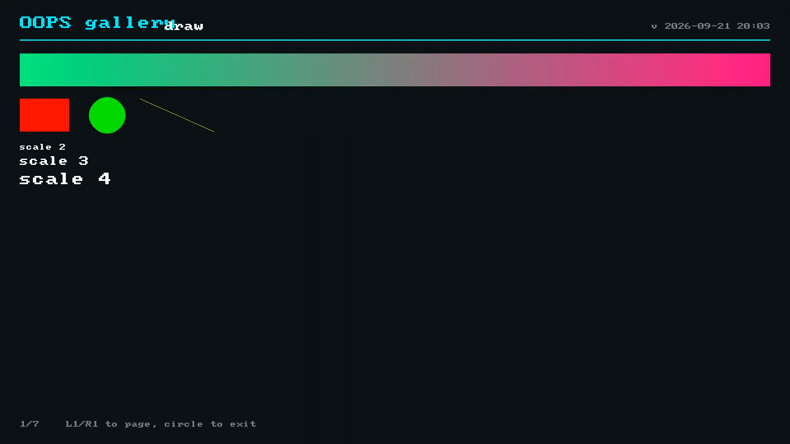

# gallery

  

A hand-driven tour of the SDK's subsystems, one page each.

## About

gallery draws one page per SDK subsystem - a gradient and primitives, live pad state, what the
machine is, audio status, the network, and a capability matrix - and lets a person page through
them and judge.

- **Shows, does not rule.** It reports what each subsystem resolves to here; whether a decode or
  a read behaves is obSCEne's job. That keeps it on the near side of the probe line.
- **Every page is host-tested.** `make check` renders every page into a memory surface and checks
  bounds, exercising both the present and absent branches of the capability matrix.

## Screenshot

  

## Docs

- [Reference](docs/REFERENCE.md) - the pages, the capability matrix, and where gallery sits relative to the probe line.
- [oops-apps catalog and guide](../../../docs/USER_GUIDE.md)
