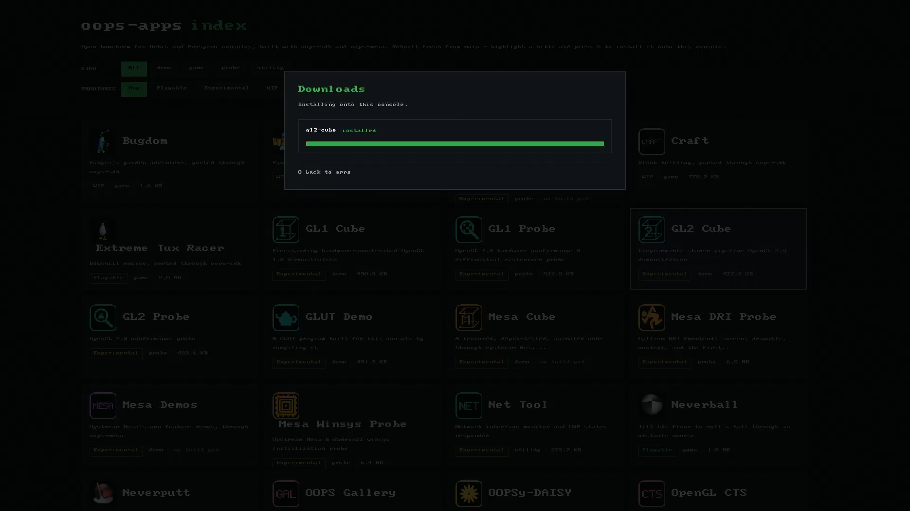
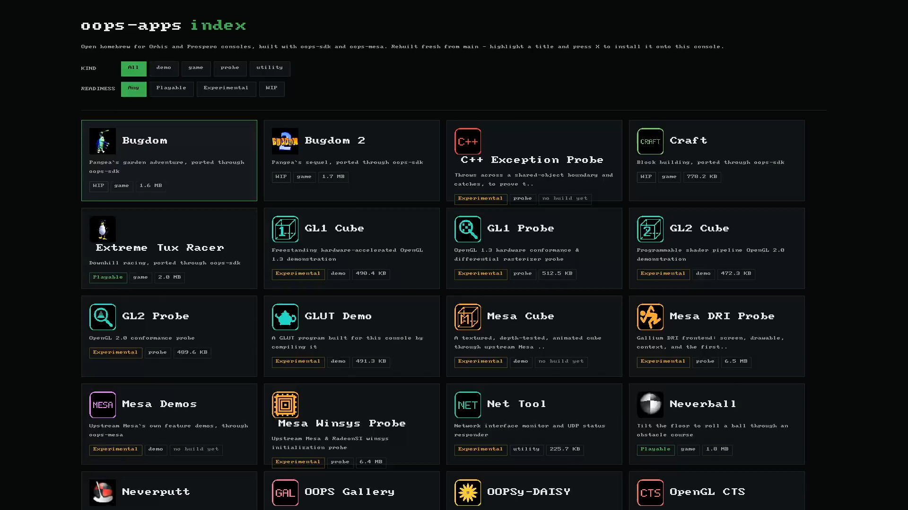

# OOPSy-DAISY

<p align="center">
  
</p>

**OOPSy-DAISY**: **D**ownload **A**rtificial **I**ntelligence **S**lop **Y**ourself.

Browse the oops-apps catalogue and install homebrew **on the console itself** — pick a title,
and OOPSy-DAISY downloads and unpacks it into the homebrew folder. No PC, no staging tool, no
cable. This is the last link in the loop: everything else builds and publishes homebrew, and
this runs on the device and pulls it down.

<p align="center">
  
  <br>
  <em>The oops-apps catalogue on the console — the same cards the web index shows, with kind and
  readiness filters, driven by the pad.</em>
</p>

<p align="center">
  
  <br>
  <em>Installing a title: the download runs on a background thread and the modal reports its
  progress and result without freezing the grid.</em>
</p>

## How it works

```
release (latest-main) ──► fetch the catalogue ──► pick a title ──► download its .zip ──► unpack into /data/homebrew ──► launch
```

- **One catalogue.** It reads the site's `apps.json` and the rolling `latest-main` release — the
  same sources the [web index](https://project-oops.github.io/oops-apps/) shows — so the cards on
  the console match the website, with no second list to keep in step.
- **The install is a drop-in.** A packaged title `.zip` carries a top-level `<TITLE_ID>/`, so
  unpacking it into `/data/homebrew` lands it exactly where the console scans for homebrew; the
  eboot is marked executable so the shell can launch it.
- **Installed titles are removable.** A card already on the console is badged **Installed**; a
  confirm dialog removes it — both its `/data/homebrew` files and its `/user/appmeta` registration.
- **It runs over the SDK.** The screen is the SDK webview rendering the index page; the catalogue
  fetch and download use [`oops/http.h`](../../../../oops-sdk/docs/API_REFERENCE.md), the unpack
  and removal use [`oops/zip.h`](../../../../oops-sdk/docs/API_REFERENCE.md) and
  [`oops/fs.h`](../../../../oops-sdk/docs/API_REFERENCE.md), and the pad drives it all.

## Status

OOPSy-DAISY ships as a title of its own — installable, of course, from itself. It browses the
catalogue in the SDK webview, downloads a title's `.zip` on a background thread with on-screen
progress, unpacks it into `/data/homebrew` with the execute bit set, and launches. Titles already
installed are badged and can be uninstalled from the same screen.

## Build & run

```bash
make check              # host self-test
make OOPSY_WEBVIEW=1 title   # the console title (eboot + webview UI)
```

The title deploys to `/data/homebrew/OPSY00001` with [Prosperous](../../../../prosperous/), like
any other homebrew title.
