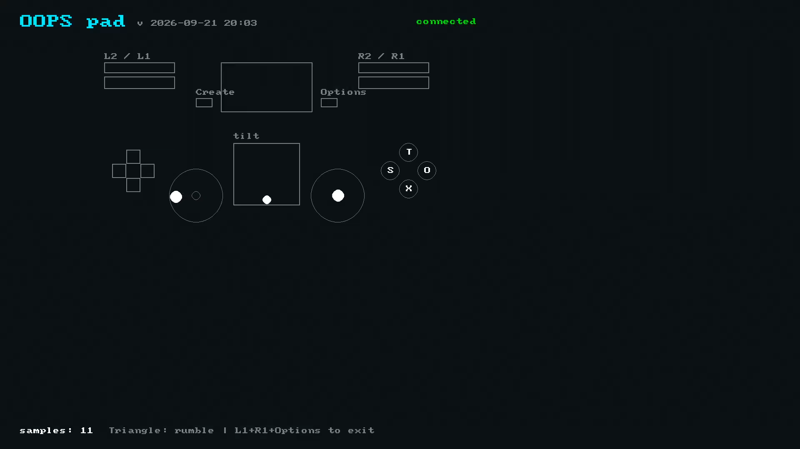

# pad-viz

  

A live controller diagram: press a button and it lights up.

## About

pad-viz draws the whole controller: buttons light when pressed, the stick thumbs move, the analog
triggers fill, the touch-pad shows its contacts, and a tilt box follows the accelerometer. Press
**L1+R1+Options** together to exit.

- **Reads the SDK's batched low-latency path**, drawing the newest of up to a full batch of
  samples a frame - the path that catches a press-and-release falling between two ordinary polls.
- **Host-tested drawing.** `make check` renders neutral, all-pressed, deflected and disconnected
  states into a buffer and checks bounds.

## Screenshot

  

## Docs

- [Reference](docs/REFERENCE.md) - the batched read path and where pad-viz sits on the probe line.
- [oops-apps catalog and guide](../../../docs/USER_GUIDE.md)
