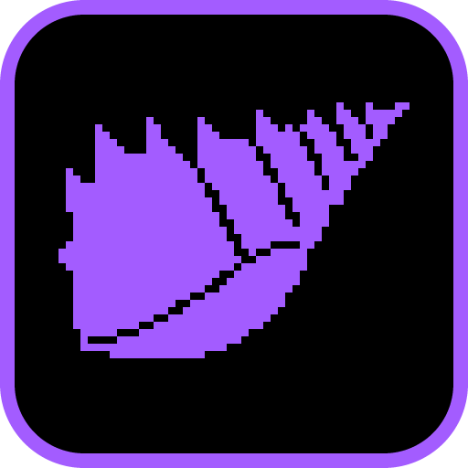
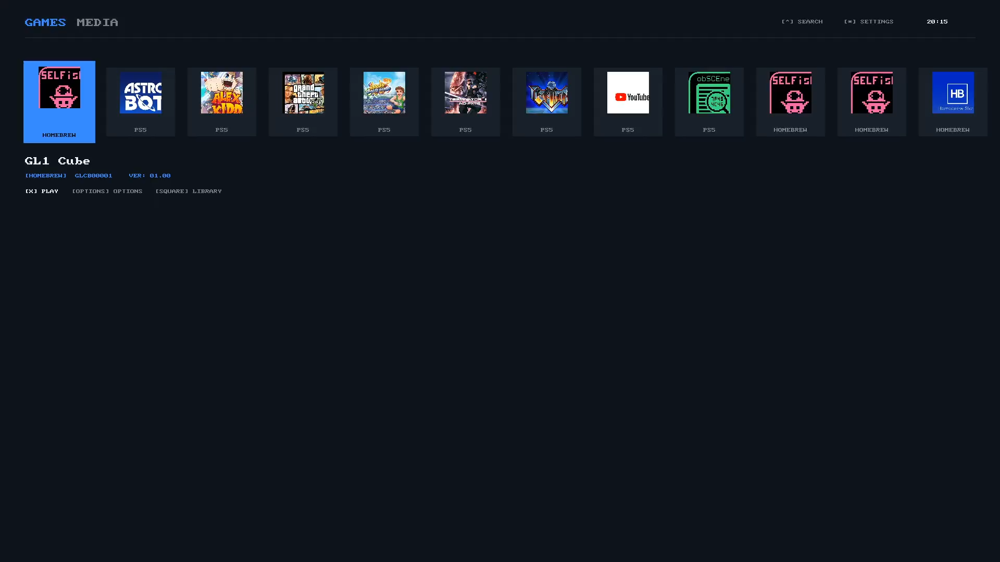

# SeaShell

  

A clean-room, freestanding system shell and homebrew launcher.

## About

SeaShell draws a complete system interface - a Games/Media carousel, game hubs with activity
cards and trophy progress, a Control Centre dock, settings trees, a storage meter, and the common
system dialogs (virtual keyboard, progress, confirmation, error) - and launches what is picked.

- **Two audiences, one codebase.** It is both the front-end shell for the
  [Orbistoun](../../../../orbistoun/) emulator and a native shell on the hardware, shipping as a
  category-0 Big App.
- **A model/host split.** Everything that does not touch a machine - navigation, screens,
  drawing - lives in the model and is tested with no display; launching, installing and power are
  the host's, behind a recorded dispatch.
- **Layout engines** over the same state: MODERN, XMB, BLADES, MEMCARD, REVOLUTION and AMBER.
- **A launcher** - universal search, favourites, a running/suspended switcher, and multi-mount
  USB scanning for titles, `.pkg` packages and `.elf` payloads.

## Screenshot

  

## Docs

- [Architecture](docs/ARCHITECTURE.md) - the model/host split, persistence, and build outputs.
- [Screens and features](docs/FEATURES.md) - the screen map and launcher capabilities.
- [Skins](docs/SKINS.md) - the layout engines and the responsiveness tuning.
- [Controls](docs/CONTROLS.md) - the input map.
- [oops-apps catalog and guide](../../../docs/USER_GUIDE.md)
